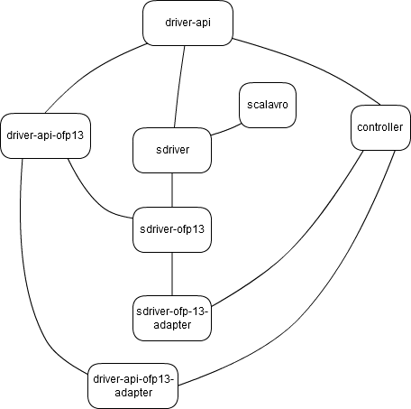

# Warp subprojects

One of goals of Warp framework is modularity. For example, users should be able to provide own protocol implementations and use them with existing controller, and these implementations may be used separately from controller. To achieve this goal, the framework is divided to several subprojects. Some of them provide basic API and functionality, others provide actual implementation of protocols.

### Projects description
**driver-api** provides basic generic interface wich each driver must implement, [dynamic API]() and helpers for defining [fixed APIs]().

**controller** is akka-based SDN controller. It (re)loads [modules](), provides [interactive console]() for execution commands and [even-bus]() for communication between loaded modules and connected switches, handles connections with switches,  etc. [Opendaylight](http://www.opendaylight.org/)-like [REST API]() provided by Warp is also part of controller.

**driver-api-ofp13** is driver-independent [OpenFlow Protocol 1.3 API](link to scaladoc).

**driver-api-ofp13-adapter** provides better [API](link_to_scaladoc) for usage driver-api-ofp13 in controller and implements low-level, protocol-dependent [modules]() used by Opendaylight REST API in trems of driver-api-ofp13.

**sdriver** provides a flexible way of description of protocol drivers which may (and may not) support dynamic API. Scala is used as description language.

**sdriver-ofp13** is an implementation of OpenFlow Protocol 1.3 driver based on sdriver. It is designed to be used as dynamic driver together with driver-api-ofp13 as well as standalone driver with scala [API](link_to_scaladoc).

**sdriver-ofp13-adapter** provides better [API](link_to_scaladoc) for usage sdriver-ofp13 in controller.

**demo** contains code examples and is used to generate all-in-one jar for quick start.

### Scalavro fork
[**scalavro**](https://github.com/GenslerAppsPod/scalavro) is a runtime reflection-based Avro library in Scala. It was forked and patched to make it suitable for protocolos definition. It is used by sdriver.
### Dependencies diagram
Connection between nodes represents dependency between projects: the below one depends on the above.



Project demo depends on all projects.
### Artifacts
Sbt build generates a jar file for each project:
``` ./<project>/target/scala-2.11/<project>_2.11-0.5.jar ```
for ```sbt package``` command and
``` ./<project>/target/scala-2.11/<project>-assembly-0.5.jar ```
for ```sbt assembly```. The difference between them is that ```assembly``` generates fat jars containing all the project dependencies, whereas ```package``` generates jars containing only the project classes, so when you use resulting libraries you have to add their dependencies to classpath.

